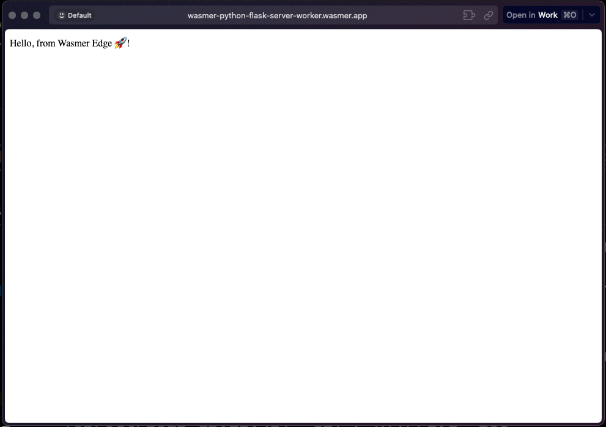

# Sample Python Flask Server with Wasmer

This is a sample repo for running a python's Flask server on Wasmer Edge.

## Running it locally

### Clone the repo

```shell
git clone https://github.com/wasmerio/python-flask-example.git
```

### Setup the Virtual Environment

```shell
python3 -m venv .env
```

### Run it locally using the command below

```shell
$ wasmer run . --net
 * Serving Flask app '/src/main'
 * Debug mode: on
WARNING: This is a development server. Do not use it in a production deployment. Use a production WSGI server instead.
 * Running on http://127.0.0.1:5000
Press CTRL+C to quit
```

## Running it using wasmer registry

This package is published to wasmer registry as [`wasmer/python-http-server`](https://wasmer.io/wasmer/python-http-server)

You can try this locally.

```shell
$ wasmer run wasmer/python-flask-worker --net
 * Serving Flask app '/src/main'
 * Debug mode: on
WARNING: This is a development server. Do not use it in a production deployment. Use a production WSGI server instead.
 * Running on http://127.0.0.1:5000
Press CTRL+C to quit
```

This would start an http server on `http://127.0.0.1:5000`



## Live on Wasmer Edge

```text
  App Info
> App Name: wasmer-python-flask-server-worker
> App URL: https://wasmer-python-flask-server-worker.wasmer.app
```
